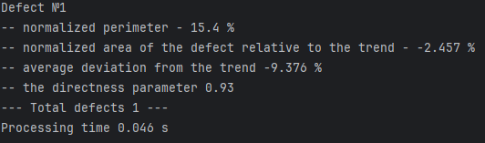
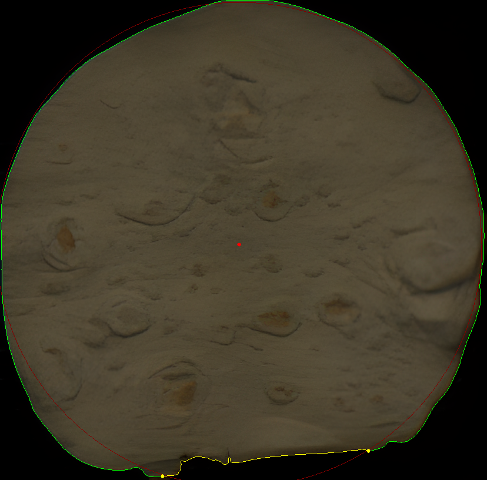
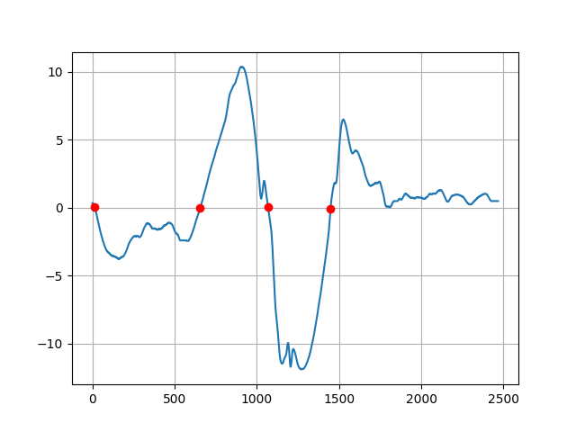

# Тестовое задание: детекция дефекта
## Алгоритм реализации
Поиск контура объекта

Нахождение контура объекта 3 варианта:
1) Пороговая бинаризаци ( возможна за счет черного фона)
2) Бинаризация OTSU
3) Алгоритм поиска краев Canny
   
Нахождение центра масс контура для расчета трендовой окружности ( нахождение средненго радиуса).

Построение и анализ сигнатуры контура и нормировка относительно трендовой окружности.

Нахождение точек пересечения на графике трендовой окружности

Разбиение на сектора , и анализ этих секторов ,выявление дефекта путем анализа параметров.

- тип сектора выпуклый или вогнутый
- относительная площадь сектора
- среднее отклонение
- параметр вогнутости (длинна прямой между двумя точками / на конткр сектора)

## Пример вывода консоли
 
## Пример визуализации
  
 
  
## Установка зависимостей 
Версия - Python 3.10

```
pip install -r requirements.txt
```


## Запуск
### Парамеры
- `-v, --visualize` -визуализация сигнатуры и котнуров
- `-ip, --img_path,` -путь до изображения

### Пример вызова 
```
detect_defect.py -v -ip test_img.bmp
```

  
